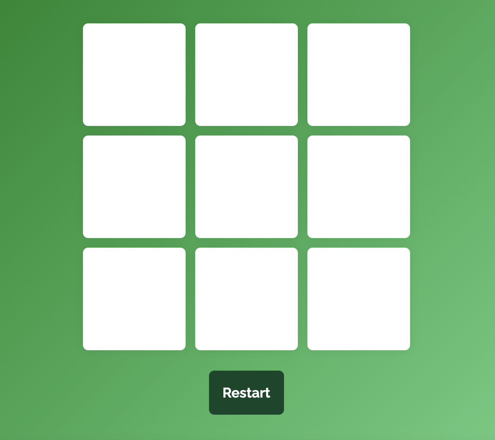

# Tic-Tac-Toe-Game

Tic tac toe activity by using React for MITxPro Coding certificate 

In this exersise Tic-Tac-Toe game with React, we practice synchronizing state between parent and child components so the board can keep track of each square in the game and each square can keep track of whose turn it is.

	
## Technologies
Project is created with:
* React hook
* JavaScript
	
## Setup
To run this project download the files locally into the same directory. Open a command line on your computer and run the command cd path/to/project/root, which allows you to point to the root folder of the starter files (note that path/to/project/root should be replaced with the actual path to the starter files)
Within the same command-line window, run npm install to install all dependencies
Once the command completes successfully, run npm start to start the application in your browser.

## Roadmap
Next improvements will be to always start by the player X, even when we restart the game.

## License
This project is open source and available under the [MIT License](LICENSE).

